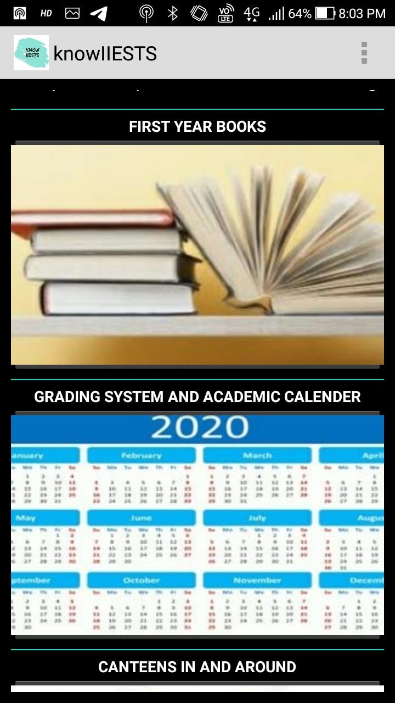
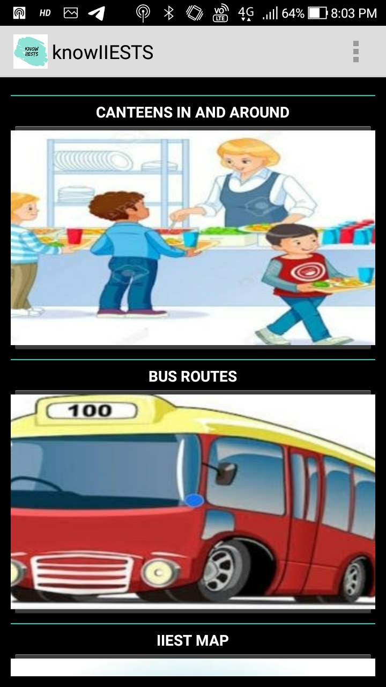
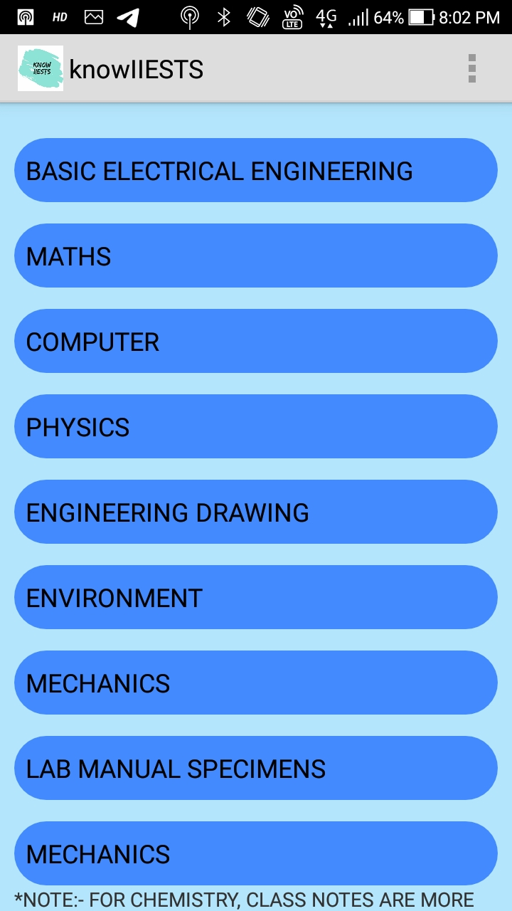
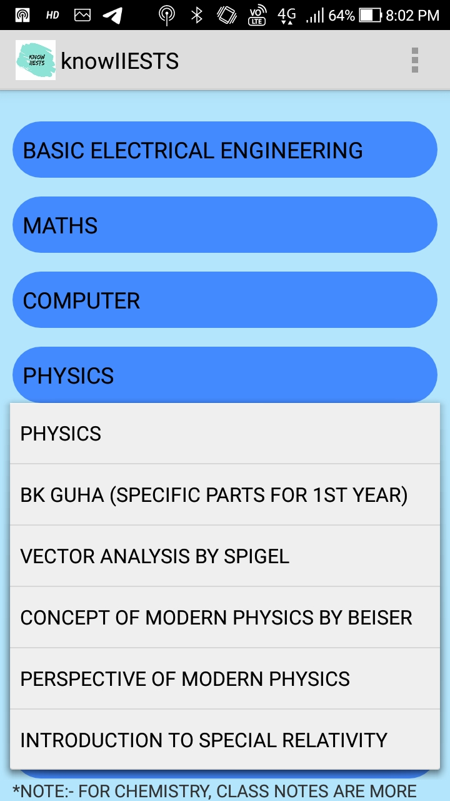
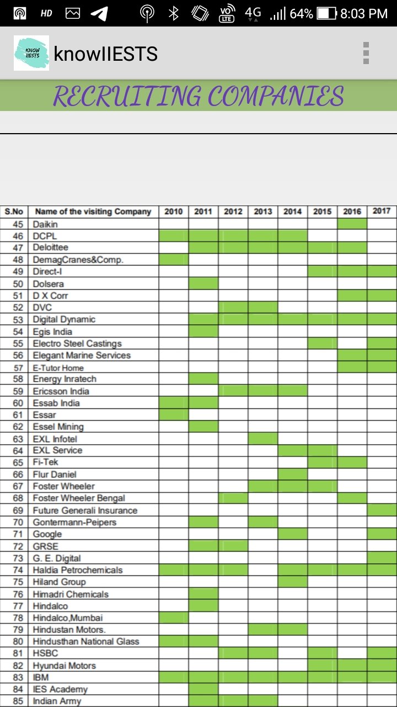

### knowIIESTS
knowIIESTS is an app built by the students of IIEST Shibpur to help the freshers know about the college. It predominantly is a frontend-only app, but has been used by a large number of students throughout the college. The app has the books referred by our professors and class notes, important bus routes to our college, tourist attraction around our college, review of the canteens within our campus and many more. We would also like to hear your views on this project.

 
 

 
 

 

 
 

 
 

 
 ### LICENCE
 
 MIT License

Copyright (c) 2020 Anish De,Devtanu Misra,Snehasish Dhar,Sounak Majumder,Malay Gain and Ahel Das Chatterjee

Permission is hereby granted, free of charge, to any person obtaining a copy
of this software and associated documentation files (the "Software"), to deal
in the Software without restriction, including without limitation the rights
to use, copy, modify, merge, publish, distribute, sublicense, and/or sell
copies of the Software, and to permit persons to whom the Software is
furnished to do so, subject to the following conditions:

The above copyright notice and this permission notice shall be included in all
copies or substantial portions of the Software.

THE SOFTWARE IS PROVIDED "AS IS", WITHOUT WARRANTY OF ANY KIND, EXPRESS OR
IMPLIED, INCLUDING BUT NOT LIMITED TO THE WARRANTIES OF MERCHANTABILITY,
FITNESS FOR A PARTICULAR PURPOSE AND NONINFRINGEMENT. IN NO EVENT SHALL THE
AUTHORS OR COPYRIGHT HOLDERS BE LIABLE FOR ANY CLAIM, DAMAGES OR OTHER
LIABILITY, WHETHER IN AN ACTION OF CONTRACT, TORT OR OTHERWISE, ARISING FROM,
OUT OF OR IN CONNECTION WITH THE SOFTWARE OR THE USE OR OTHER DEALINGS IN THE
SOFTWARE.
